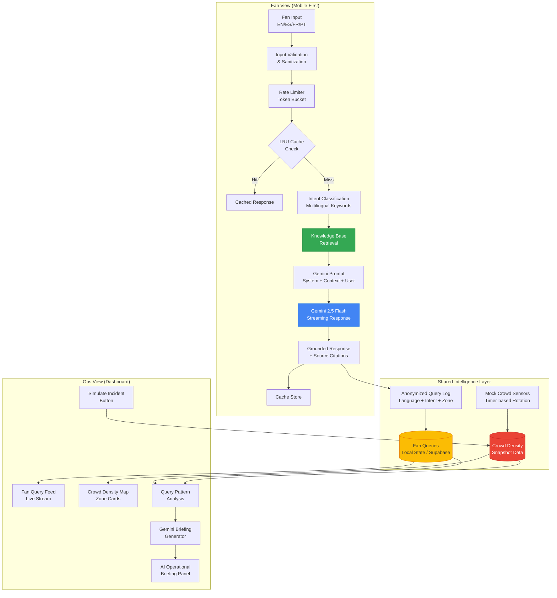

# Aficionado AI — Architecture

> System architecture for the multilingual AI stadium companion.

## System Overview



## Data Flow

### Fan Chat Pipeline
1. **Input** → User types in any supported language
2. **Validation** → Length check, sanitization (HTML entities, null bytes)
3. **Rate Limiting** → Token bucket (10 requests burst, 2/10s refill)
4. **Cache Check** → LRU lookup by normalized query + language key
5. **Intent Classification** → Multilingual keyword matching against 10 categories
6. **Knowledge Retrieval** → Structured extraction from venue-knowledge.json
7. **Gemini Call** → System prompt (isolated) + grounding context + user message
8. **Response** → Formatted, cached, and displayed with source citations

### Ops Briefing Pipeline
1. **Data Collection** → Fan queries (anonymized) + crowd density snapshot
2. **Pattern Analysis** → Language/intent/zone aggregation
3. **Gemini Synthesis** → Combined data → natural language briefing + actions
4. **Display** → Formatted briefing with status indicators

## Component Architecture

```mermaid
graph LR
    subgraph App
        R[Router] --> FV[/fan - FanLayout]
        R --> OV[/ops - OpsLayout]
    end

    subgraph "Fan Components"
        FV --> FC[FanChat]
        FC --> CM2[ChatMessage]
        FC --> TI[TypingIndicator]
        FC --> LB[LanguageBadge]
    end

    subgraph "Ops Components"
        OV --> OD[OpsDashboard]
        OD --> CDM[CrowdDensityMap]
        OD --> QF2[FanQueryFeed]
        OD --> BP2[BriefingPanel]
        OD --> SIB[SimulateIncidentButton]
    end

    subgraph Services
        GC[geminiChat] --> KBS[knowledgeBase]
        GC --> CACHE2[cache]
        GC --> RLM[rateLimiter]
        GC --> VALID[validation]
        GB2[geminiBriefing] --> MCD[mockCrowdData]
    end

    FC --> GC
    OD --> GB2
    OD --> MCD
```

## Key Design Decisions

| Decision | Rationale |
|----------|-----------|
| Client-side Gemini calls | Hackathon demo simplicity; avoids deploying Edge Functions |
| Local state for query feed | Self-contained demo; no Supabase table setup required |
| JSON knowledge base (not vector DB) | Structured venue data fits keyword matching; no vector overhead |
| Snapshot-based mock data | Predictable for demos; avoids random generator complexity |
| System prompt isolation | Security — user input never in system role |
| LRU cache (not Redis) | Single-instance demo; production would use distributed cache |
